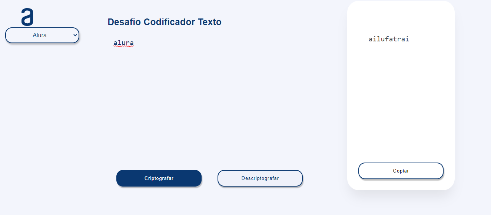
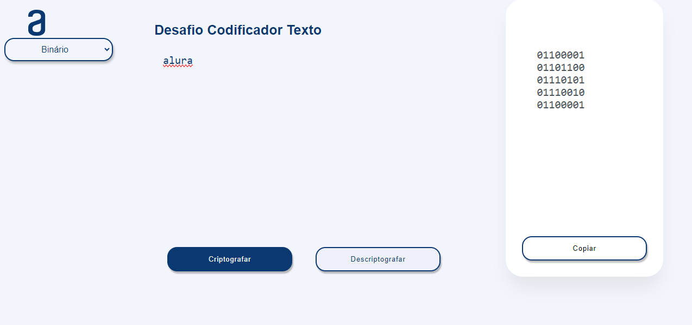
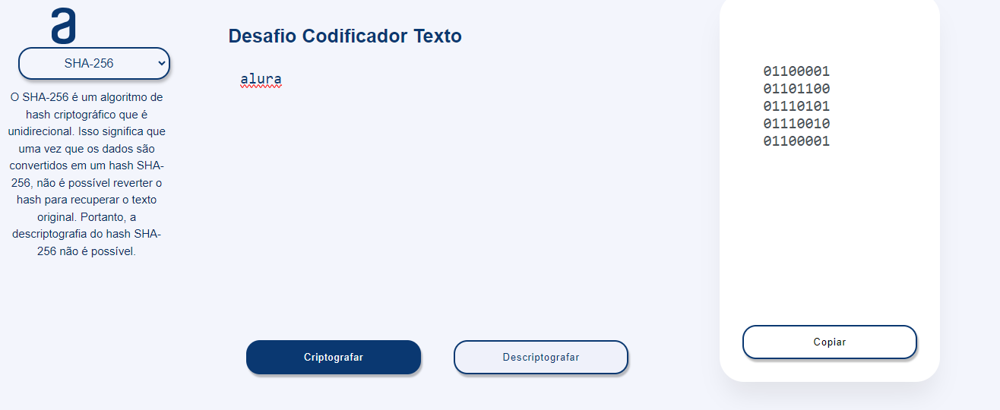
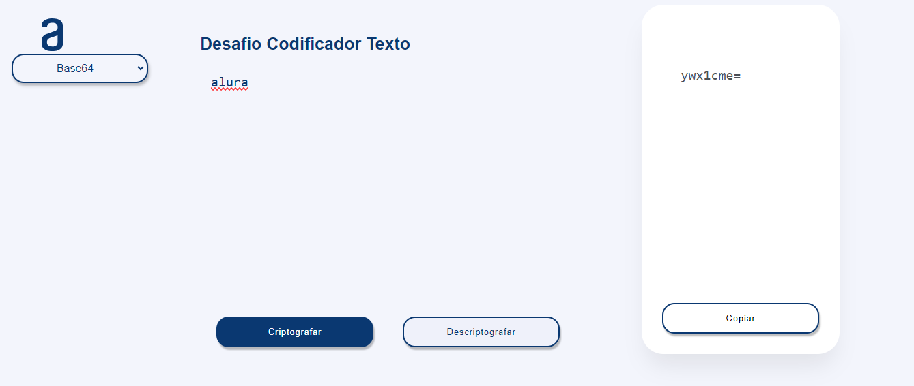

# Desafio Alura + Oracle ONE

## Codificador e Decodificador de Texto

### Descrição

Este projeto é uma aplicação web para criptografar e descriptografar textos usando diversos métodos. Os métodos disponíveis incluem:

- **Alura**: Um método simples de substituição.

- **Binário**: Representação do texto em código binário.

- **SHA-256**: Função de hash criptográfico unidirecional.

- **Base64**: Codificação e decodificação em Base64.

